# 课程基本信息

课程网站：https://missing.csail.mit.edu/2020/

课程视频：https://www.youtube.com/playlist?list=PLyzOVJj3bHQuloKGG59rS43e29ro7I57J

# 课程笔记

## Lecture 1. Course overview + the shell

### command

`pwd` - print working directory

`cd` - change directory

`~(tilde)` - home directory

`-(dash)` - previous directory

`--help` - show the help info

`-l` - list the detail info 

`man` - manual page 

`<` - rewire the input stream

`\>` - rewire the output stream(overwrite)

`>>` - rewire the output stream(append)

`cat` - concatenate

`|` - pipe

`sudo su` - root

`sudo tee`

`xdg-open`

### Exercises

2. 
```shell
cd ../../tmp
mkdir missing
```

3. 
```shell
man touch
```

4. 
```shell
cd missing/
touch semester
```

5. 
```shell
echo '#!/bin/sh' > semester
echo 'curl --head --silent https://missing.csail.mit.edu' >> semester
```

6. 
``` shell
./semester
ls -l semester
```

7. 
``` shell
sh semester
```

8. 
``` shell
man chmod
```

9. 
``` shell
chmod 755 ./semester
./semester
```

10. 
``` shell
./semester | grep last-modified > ~/last-modified.txt
cat ~/last-modified.txt
```

11. 
``` shell
cat /sys/class/power_supply/battery/capacity
``` 

## Lecture 2. Shell Tools and Scripting
`$0` - the name of the script

`$1 - $9` - the args that the bash script takes

`$?` - th error code from the previous command

`$_` - the last arg of the previous command

`!!` - the last command

`$#` - the number of the args

`\$$` - the pid of the running command

`$@` - the all args 

`2>` - redirect the error standard stream

`$() <()` - replace cmd

### Exercises
1. 
```shell
man ls
ls -a -t -h --color=auto -l
```
2.  
```shell
#!/bin/bash

marco () {
        tmp_path=$(pwd)
}

polo () {
        cd "$tmp_path"
}
```

3.  
```shell
#!/bin/bash

ex3_path="/home/yggycs"

num=1
$ex3_path/ex3.sh > "$ex3_path/ex3.log"

while [ "$?" -ne 1 ]; do
        num=$(($num+1))
        $ex3_path/ex3.sh >> "$ex3_path/ex3.log" 2> "$ex3_path/ex3err.log"
done

echo "$num"
cat "$ex3_path/ex3.log" "$ex3_path/ex3err.log"
```

4.  

```shell
find . -name '*.html' | xargs -d '\n' tar -cvf html.tar
```


5.  
```shell
find . -type f | xargs -d '\n' ls -t -l -h
```

## Lecture 3. Editors (Vim)

### Exercises
1. 
```shell
vimtutor
```

2. 
```shell
touch .vimrc
```

3. 
```shell
mkdir -p ~/.vim/pack/vendor/start
cd ~/.vim/pack/vendor/start; git clone https://github.com/ctrlpvim/ctrlp.vim

# vim command
:Ctrl-P

# ~/.vimrc
# let g:ctrlp_map = '<c-p>'
# let g:ctrlp_cmd = 'CtrlP'
```

6. 
- Chrome 插件： Vimium

- 配置 vscode + vim 编辑器

8. 
- `Gdd`, `ggdd` delete first and last lines
- Macro to format a single element (register `e`)
    - Go to line with `\<name>`
    - `qe^r"f>s": "\<ESC>f\<C"\<ESC>q`
- Macro to format a person
    - Go to line with `\<person>`
    - `qpS{\<ESC>j@eA,\<ESC>j@ejS},<ESC>q`
- Macro to format a person and go to the next person
    - Go to line with `\<person>`
    - `qq@pjq`
- Execute macro until end of file
`999@q`
- Manually remove last `,` and add `[` and `]` delimiters

## Lecture 4. Data Wrangling

`sed` - a stream editor

`sed -E`

`capture groups`

`wc` - word counting

`sort`

`uniq`

`head -n`

`tail -n`

`awk` - column stream editor

`paste`

`bc`

`R` - R programming language

`gnuplot` - plotter

`xargs`

`ffmpeg` 

`convert`

`-` - turn the file output to a stream output

### Exercise
2.  
``` shell
cat /usr/share/dict/words | tr [:upper:] [:lower:] | grep -E "^([b-z]*a){3}[a-z]*$" | grep -v "'s$" | wc -l

cat /usr/share/dict/words | tr [:upper:] [:lower:] | grep -E "^([b-z]*a){3}[a-z]*$" | grep -v "'s$" | sed -E "s/.*([a-z]{2})$/\1/" | sort | uniq -c | sort -nk1,1 | tail -n3

cat /usr/share/dict/words | tr [:upper:] [:lower:] | grep -E "^([b-z]*a){3}[a-z]*$" | grep -v "'s$" | sort | uniq | wc -l

# tmp0.sh
#!/bin/bash
for i in {a..z}; do
    for j in {a..z}; do
        echo "$i$j"
    done
done

./tmp0.sh > tmp0.log
cat /usr/share/dict/words | tr [:upper:] [:lower:] | grep -E "^([b-z]*a){3}[a-z]*$" | grep -v "'s$" | uniq > tmp1.log 
cat tmp0.log tmp1.log | sort | uniq -u
```

3. 输出流目的文件会先被清空导致命令运行不正确，不是 sed 特有的，而是使用 > 带来的。 
``` shell
sed -i.bak "s/REGEX/SUBSTITUTION/" input.txt
```

4. 
``` shell
journalctl | sed -E "s/Startup finished in (\d+)ms \./\1/" | tail -n10 | sort | tail -n1
journalctl | sed -E "s/Startup finished in (\d+)ms \./\1/" | tail -n10 | sort | head -n1
journalctl | sed -E "s/Startup finished in (\d+)ms \./\1/" | tail -n10 | paste -sd+ | bc -l | awk '{print $1/10}'
journalctl | sed -E "s/Startup finished in (\d+)ms \./\1/" | tail -n10 | sort | head -n6 | tail -2 | paste -sd+ | bc -l | awk '{print $1/2}'
```

5. 
``` shell
journalctl -b 0 > tmp.log
journalctl -b -1 >> tmp.log
journalctl -b -2 >> tmp.log
cat tmp.log | grep "Startup finished in" | sed -E "(s/.*in).*s \.$/\1/" | sort | uniq -c | awk '$1!=3 { print }'
```

6. 
``` shell
curl "https://ucr.fbi.gov/crime-in-the-u.s/2016/crime-in-the-u.s.-2016/topic-pages/tables/table-1" > data.html
cat data.html | pup ".group0 text{}" > column1.log
cat data.html | pup ".group1 text{}" > column2.log
paste column1.log column2.log | awk '{ print $1 }' | sort -n | sed -n '1p;$p;'

paste column1.log column2.log | sed -E 's/(.*)\s(.*)$/\1-(\2)/' | paste -sd+ | bc -l
```

## Lecture 5. Command-line Environment
- job control

    `\<c-c>` - SIGINT

    `\<c-\\>` - SIGQUIT

    `\<c-z>` - SIGSTOP

    `jobs`

    `bg %[jobId]`

    `fg %[jobId]`

    `kill [-STOP][-HUP][-KILL] %[pid]`

    `nohup`

- terminal multiplexers
    `tmux`

    `\<c-b> d` - detach
    
    `\<c-a> d` - detach

    `tmux a` - return to the window

    `tmux new -t [name]` - create a new window with name

    `tmux  ls` - list all the windows

    `\<c-a> c` - open a new window

    `\<c-a> p` - open the previous window

    `\<c-a> n` - open the next window
    
    `\<c-a> [num]` - open the window with the number of num

    `\<c-a> ,` - rename the current window

    `\<c-a> "` - split the window

    `\<c-a> %` - split the window

    `\<c-a> arrow keys` - navigate between different panes

    `\<c-a> space` - show different layouts

    `\<c-a> z` - zoom/go back

- dotfiles
    
    `alias` - .bashrc
    
    dotfiles should be put in the home dict

    `PS1=""` - .bashrc
    
- romete machines

    `ssh` 

    `scp`

    `rsync`
    
    `.ssh/config`

### Exercise

- Job Control

1. 
``` shell
sleep 10000
^Z
jobs
bg %1

pkill -9 -f "$(pgrep -af "sleep 10000" | awk '{ print $2,$3 }')"
```

2. 
``` shell
sleep 60
wait $!; ls


#!/bin/bash

kill -0 $1 2> /dev/null
while [ $? -eq 0 ]; do
        sleep 10
        kill -0 $1 2> /dev/null
done

echo "The process with the given pid '$1' is done!"


sleep 30 &
./pidwait.sh [pid]
```

- Terminal multiplexer

1. [tmux guide](https://hamvocke.com/blog/a-quick-and-easy-guide-to-tmux/)   [tmux conf](https://hamvocke.com/blog/a-guide-to-customizing-your-tmux-conf/)


- Aliases

1. 
``` shell
vim ~/.bashrc

alias dc=cd

source ~/.bashrc
```

2. 
``` shell
history | awk '{$1="";print substr($0,2)}' | sort | uniq -c | sort -n | tail -n 10
vim ~/.bashrc

alias xx=xx

source ~/.bashrc
```

- Dotfiles

1. 
``` shell
mkdir -p docfiles
```

2. 
``` shell
vim ~/.bashrc

PS1="> "
```

3. 
``` shell
ln -s [source] ~/[docfile name]
```

- Remote Machines

1. 
``` shell
ls ~/.ssh/'

ssh-keygen -o -a 100 -t ed25519
```
[ssh-agent](https://www.ssh.com/ssh/agent)

2. 
``` shell
vim ~/.ssh/config

Host vm
    User username_goes_here
    HostName ip_goes_here
    IdentityFile ~/.ssh/id_ed25519
    LocalForward 9999 localhost:8888
```

3. 
``` shell
ssh-copy-id [-i [identity_file]] [user@]machine
```

4. 
``` shell
(VM) python -m http.server 8888
(local) curl http://localhost:9999
```

5. 
``` shell
(VM) sudo vim /etc/ssh/sshd_config

PasswordAuthentication no
PermitRootLogin no

(VM) sudo reboot
(VM) sudo service sshd restart
```

6. 
``` shell
(VM) sudo apt-get install mosh
(VM) mosh-server

(base) sudo apt-get install mosh
(base) mosh username@ip

(VM) ip a
(VM) ipconfig [NIC_name] down

(这里 mosh 和 ssh 应该都会断连，因为 mosh 使用的是 UDP)

(VM) ipconfig [NIC_name] up

(这里 mosh 和 ssh 应该都会重连)
```

7. 


[ssh 端口转发](https://www.cainiaojc.com/ssh/ssh-port-forwarding.html)
``` shell
ssh -f -D local-port tunnel-host -N
ssh -f -L local-port:target-host:target-port tunnel-host -N
ssh -f -R remote-port:target-host:target-port -N remotehost 
```

## Lecture 6. Version Control (Git)

`git init`

`git help [command]`

`git status`

`git add [file]`

`git commit`

`git log`

`git cat-file -p [hash]`

`git commit -a`

`git add :/`

`git log --all --graph --decorate --oneline` - show the git log as a graph

`git checkout`

`git diff`

`git branch -vv`

`git merge`

`git merge --continue`

`git remote` 

`git push`

`git fetch`

`git pull`

`git bisect`

### Exercise
2. 
``` shell
git clone https://github.com/missing-semester/missing-semester.git

git log --all --graph --decorate

git log --all --graph --decorate -p ./README.md

git blame ./_config.yml
git show a88b4eac
```

3. 
[Removing sensitive data from a repository](https://docs.github.com/en/authentication/keeping-your-account-and-data-secure/removing-sensitive-data-from-a-repository)
``` shell
brew install git-filter-repo
git clone https://github.com/YOUR-USERNAME/YOUR-REPOSITORY
cd YOUR-REPOSITORY
git filter-repo --invert-paths --path PATH-TO-YOUR-FILE-WITH-SENSITIVE-DATA
echo "YOUR-FILE-WITH-SENSITIVE-DATA" >> .gitignore
git add .gitignore
git commit -m "Add YOUR-FILE-WITH-SENSITIVE-DATA to .gitignore"
git remote add origin https://github.com/OWNER/REPOSITORY.git
git push origin --force --all
git push origin --force --tags
```

4. 
``` shell
git stash
git log --all --graph --decorate --oneline
git stash pop
```

5. 
``` shell
git config --global alias.graph "log --all --graph --decorate --oneline"
git graph
```

6. 
``` shell
git config --global core.excludesfile ~/.gitignore_global
touch ~/.gitignore_global
echo '.DS_Store' >> ~/.gitignore_global
```

7. 
[first-contributions](https://github.com/firstcontributions/first-contributions)
``` shell
git clone git@github.com:yggycs/first-contributions.git
cd first-contributions
git switch -c yggycs-new-branch
```

``` shell
git status
git add Contributors.md
git commit -m "Add yggycs to Contributors list"
git push -u origin yggycs-new-branch
```

## Lecture 7. Debugging and Profiling

- debugging

    `/var/log`

    `logger "Hello Logs"`

    `ipdb`

    `gdb` - 非常底层的调试器

    `strace`

    `pyflacks`, `mypy` - static analysis tool

    `writegood` - English static analysis tool

    `perf`


- profiling(性能分析)

    `real time`, `user time`, `system time`

    `tracing profiler`

    `sampling profiler`

    `cProfile`

    `kernprof` - line profiler

    `memory profiler`

    `flame graph`

    `call graph`

    `htop`

    `stress`

    `du` - disk usage

    `ucdu`

    `lsof` - list of open files

    `hyperfine`

### Exercise

- Debugging

1. 
``` shell
sudo ls
journalctl --since yesterday | grep "sudo"
```

2. 
    [pdb-tutorial](https://github.com/spiside/pdb-tutorial)

    [Python Debugging With Pdb](https://realpython.com/python-debugging-pdb/)

3. 
``` shell
sudo apt install shellcheck
shellcheck ~/mit-missing-semester/lec7/ex3.sh
```
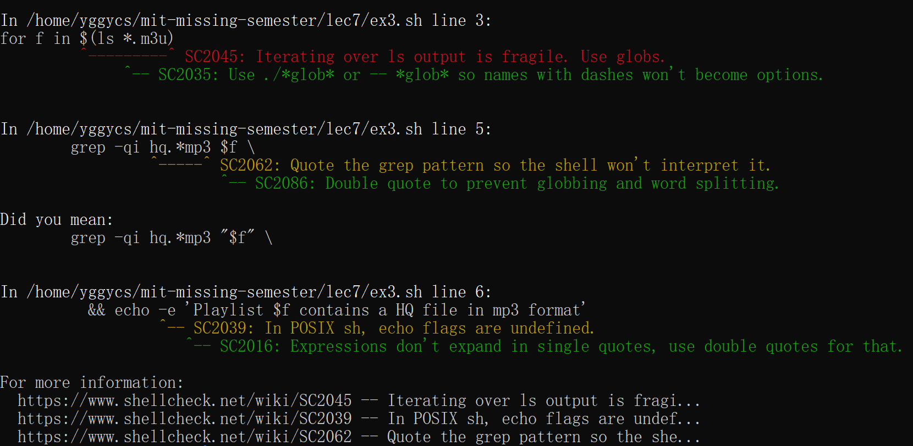
``` shell
for f in $(ls -- *.m3u)

    grep -qi hq.*mp3 "$f" \

      && echo -e "Playlist $f contains a HQ file in mp3 format"
```
在 vscode 中可以安装 ShellCheck 插件

4. [reversible debugging](https://undo.io/resources/reverse-debugging-whitepaper/) [rr](https://rr-project.org/) [RevPDB](https://morepypy.blogspot.com/2016/07/reverse-debugging-for-python.html) [rr演示视频](https://www.youtube.com/watch?v=hYsLBcTX00I)

- Profiling

5. 
``` shell
pip install line_profiler
pip install rich
```
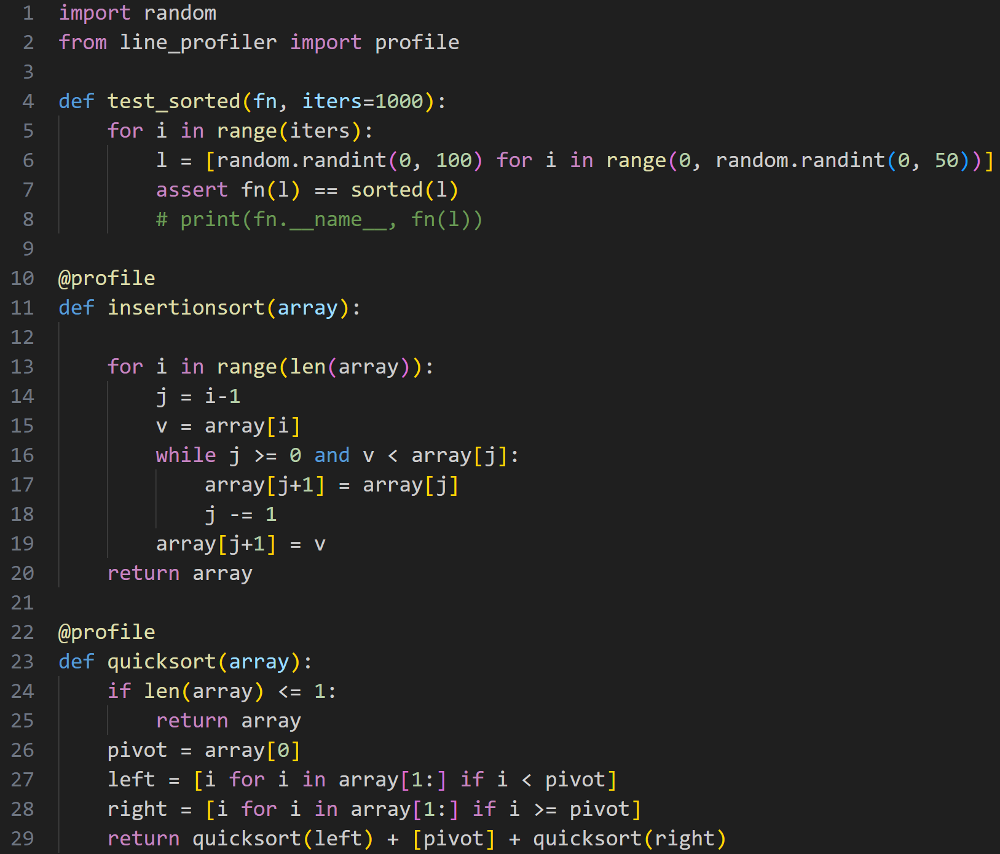
``` shell
python3 -m kernprof -lvr sorts.py
```
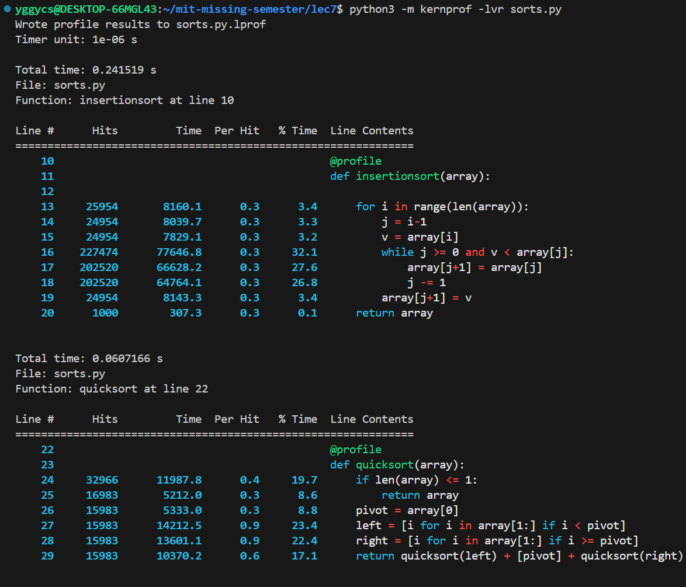
插入排序的瓶颈在于内层的 while 循环，可以看到内层 while 循环的 Hits 值很大。快排的瓶颈主要在于准备子问题 left 和 right。
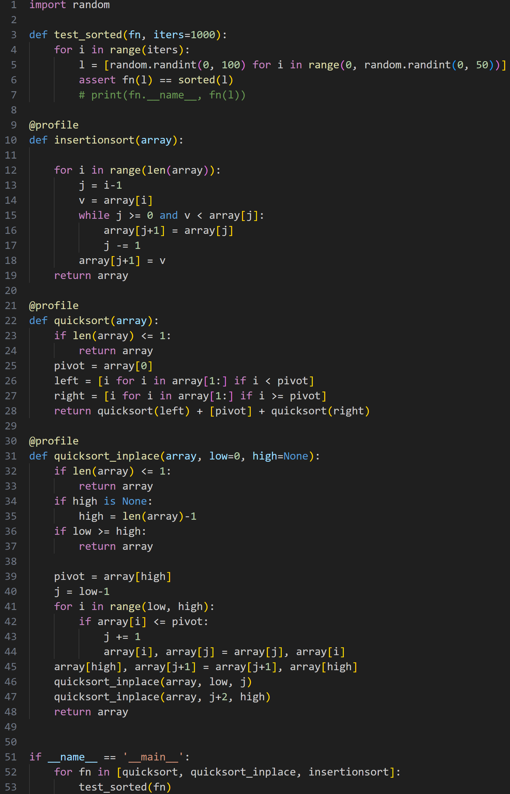
``` shell
pip install -U memory_profiler
python3 -m memory_profiler sorts.py
```
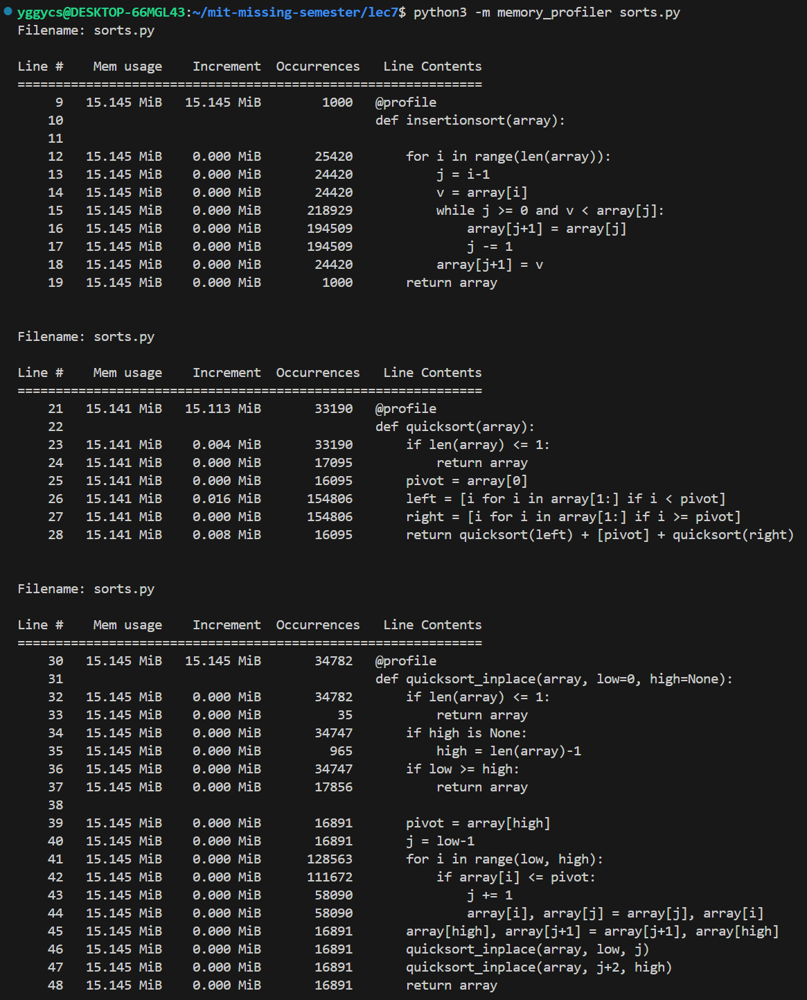
这里结果与预想的不符，主要是因为测试的规模还是比较小。学习 memory_profiler 的基本使用方法即可。
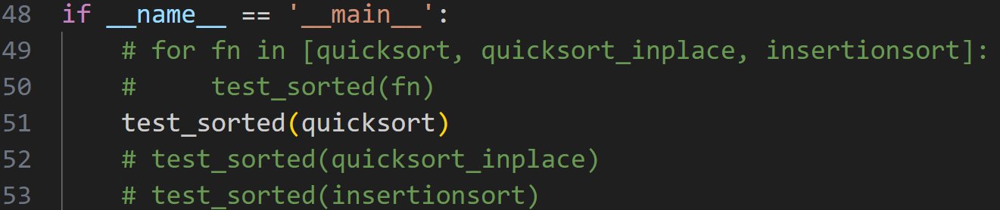
``` shell
sudo perf stat -e cpu-cycles,cache-references,cache-misses python3 sorts.py
```
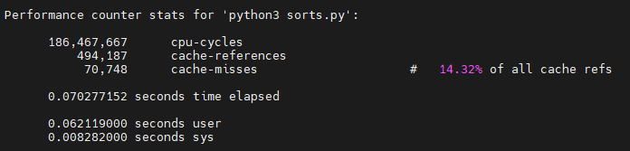
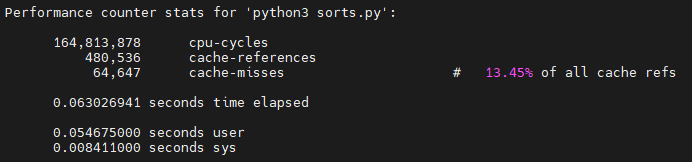
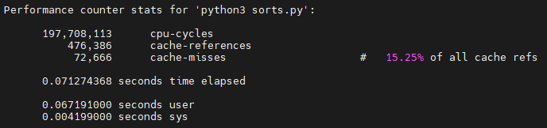

6. 
``` shell
touch fib.py
sudo apt install python3-pycallgraph
sudo apt install graphviz
pycallgraph graphviz -- ./fib.py
```
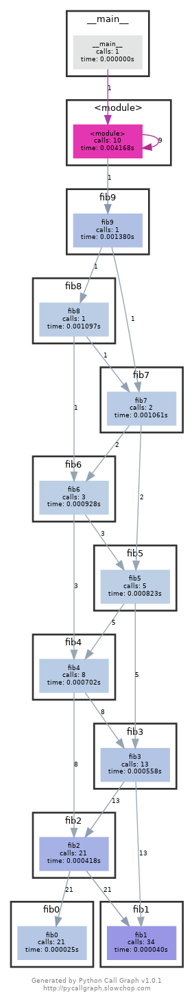

可以看到 fib0 被调用了 21 次。

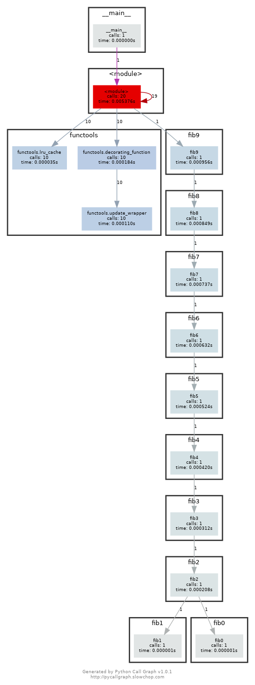

可以看到每个 fibN 只被调用了一次。

7. 
``` shell
python3 -m http.server 4444

lsof | grep LISTEN
kill <PID>
```

8. 
``` shell
stress -c 3
htop
```
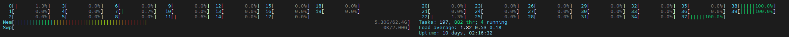
``` shell
taskset --cpu-list 0,2 stress -c 3
```

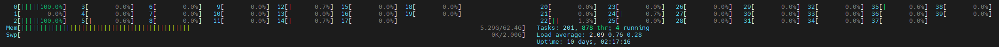

taskset 将任务限制在 #0 和 #2 两个 cpu 资源上。

[知乎 - Cgroup使用介绍](https://zhuanlan.zhihu.com/p/651405353)

9. 
``` shell
curl ipinfo.io
```
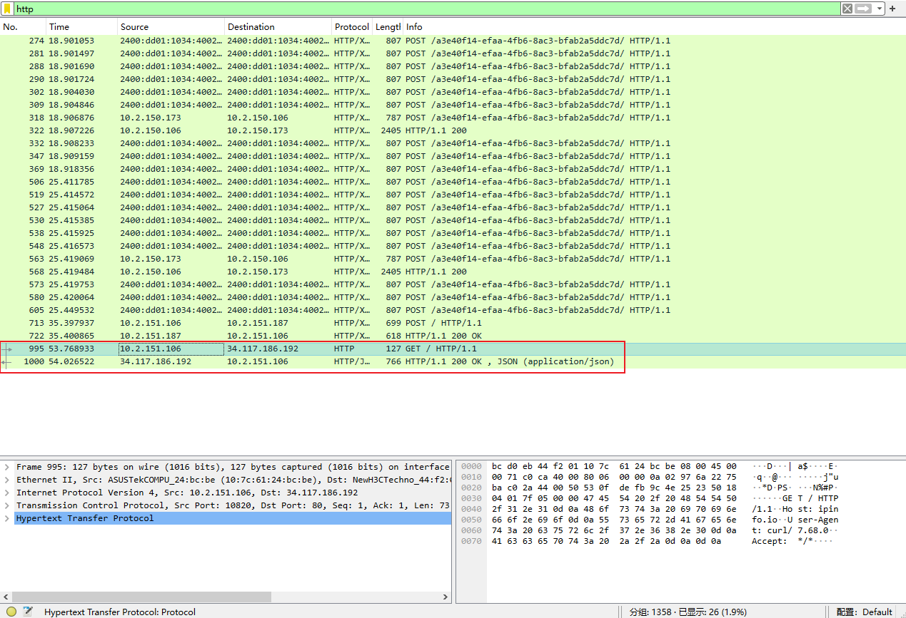

## Lecture 8. Metaprogramming

- build systems
    
    `make`

    `Makefile`

- dependency management

    `semantic versioning` - major version, minor version, patch version

    `lock file`

    `vendoring`

- continuous integration systems

    `recipe`

    `github page`

- testing

    `unit test` - test a single feature

    `integration test` - test the interaction between different subsystems of a program

    `regression test` - test things that were broken in the past

    `mocking` - be able to replace parts of the system

### Exercise

1. 
``` shell
.PHONY: clean

clean: 
	git ls-files -o | xargs rm
```

2. 
``` shell
# Caret requirements
# Caret requirements are the default version requirement strategy. This version strategy allows SemVer compatible updates.
log = "^1.2.3"

# Tilde requirements
# Tilde requirements specify a minimal version with some ability to update. If you specify a major, minor, and patch version or only a major and minor version, only patch-level changes are allowed. If you only specify a major version, then minor- and patch-level changes are allowed.
log = "~1.2.3"

# Wildcard requirements
# Wildcard requirements allow for any version where the wildcard is positioned.
log = "1.2.*"

# Comparison requirements
# Comparison requirements allow manually specifying a version range or an exact version to depend on.
log >= 1.2.0

# Multiple version requirements
# multiple version requirements can be separated with a comma
log >= 1.2, < 1.5
```

3. 
``` shell
cd .git/hooks/
touch pre-commit
chmod 755 pre-commit
vim pre-commit

#!/bin/bash

make

if [ $? -ne 0 ];
then
        echo '[error]: cannot build the pdf file!'
        exit 1
fi
```

4. 为项目 [yggycs-try](https://github.com/yggycs/yggycs-try) 增加 shellcheck 的 CI 环境

    **Step1.** 在项目 Actions 中新建 workflow，选择 set up a workflow yourself，可以看到在 .github\workflows 目录下新建了文件 main.yml。

    **Step2.** 参考 [Github Action - ShellCheck](https://github.com/marketplace/actions/shellcheck) 补充 main.yml。

    **Step3.** 保存文件，推送至 Github 仓库。

    **Step4.** 在本地拉取更改，新建文件 test.sh，编辑文件后提交，检查 Github Actions 的状态。根据错误提示修改代码重新提交即可。

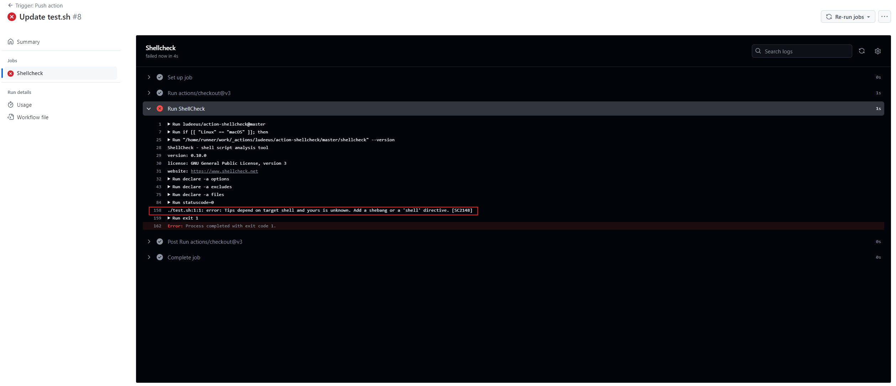

5. 为项目 [yggycs-try](https://github.com/yggycs/yggycs-try) 增加 Lint Markdown 的 CI 环境

    **Step1.** 参考 [Github Action - Lint Markdown](https://github.com/marketplace/actions/lint-markdown) 补充 main.yml。

    **Step2.** 保存文件，推送至 Github 仓库。

    **Step3.** 在本地拉取更改，新建文件 test.md，编辑文件后提交，检查 Github Actions 的状态。根据错误提示修改代码重新提交即可。

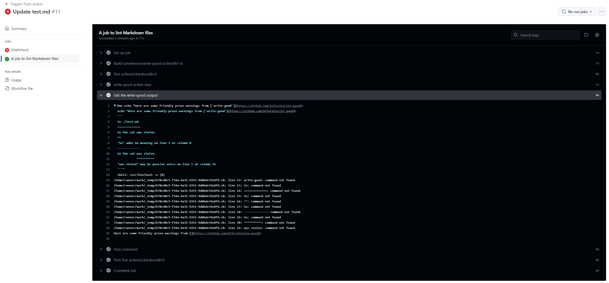

## Lecture 9. Security and Cryptography

- Entropy

    $ Entropy = \log_2(\#possibility)$

- Cryptographic hash functions

    sha1(bytes) -> 160 bits

    hard-to-invert functions that have random-looking outputs

    non-invertiable

    collision resistant

    `sha1sum`

    commitment scheme

- Key Derivation Functions (KDF)

    PBKDF2: slow, slow down the attackers

- Symmetric cryptography
    
    - Keygen() -> key [randomized]

    - encrypt(plaintext, key) -> ciphertext

    - decrypt(ciphertext, key) -> plaintext

    ---

    given ciphertext, one cannot figure the plaintext without a key

    decrypt(encrypt(m, k), k) = m

    ---

    `AES256`

    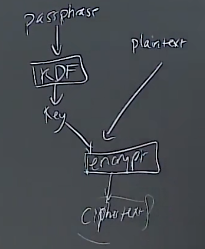

    `openssl`

    salt value

- Asymmetric cryptography

    - Keygen() -> (public key, private key)

    - encrypt(plaintext, public key) -> ciphertext

    - decrypt(ciphertext, private key) -> plaintext

    ---

    - sign(message, private key) -> signature

    - verify(message, signature, public key) -> ok?

    hard to forge without a private key

    ---

    `RSA`

    email encryption - PGP public key

    sign the software

- key distribution

    PGP

    [keybase](https://keybase.io/)

- Hybrid encryption

    

### Exercise

- Entropy

1. $ Entropy = \log_2(100000^4) = 66.4$

2. $ Entropy = \log_2(62^8) = 47.6$

3. The former one is stronger.

4. $\frac{100000^4}{1000} = 10^{17} seconds; \frac{62^8}{1000} = 2.2 \times 10^{11} seconds$

- Cryptographic hash functions

1. 
``` shell
wget https://mirrors.tuna.tsinghua.edu.cn/debian-cd/current/amd64/iso-cd/debian-12.5.0-amd64-netinst.iso
sha1sum debian-12.5.0-amd64-netinst.iso
```

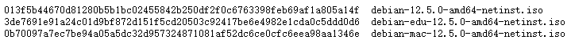
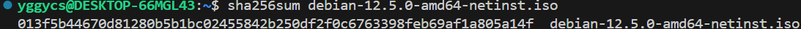

- Symmetric cryptography

1. 
``` shell
touch try.md
openssl aes-256-cbc -salt -in try.md -out try_encrypt.md
cat try_encrypt.md
hexdump try_encrypt.md
openssl aes-256-cbc -d -in try_encrypt.md -out try_decrypt.md
cmp try.md try_decrypt.md
```
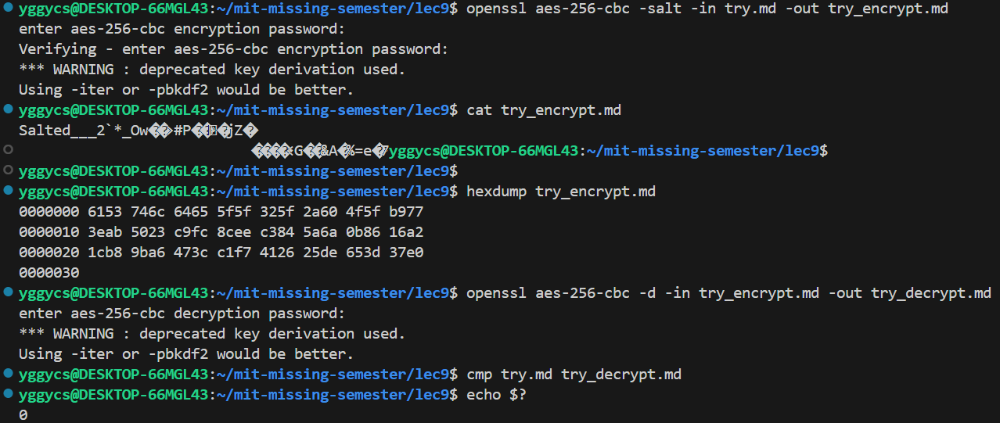

- Asymmetric cryptography

1. 
``` shell
ssh-keygen -t ed25519
```

2. 
``` shell
sudo apt-get install gnupg
gpg --gen-key
```

3. 
``` shell
# curl + gpg pro tip: import anish's keys
curl https://keybase.io/anish/pgp_keys.asc | gpg --import

gpg --encrypt --sign --armor -r person@email.com name_of_file
```

4. 
``` shell
export GPG_TTY=$(tty)
gpg --list-secret-keys --keyid-format SHORT
git config --global user.signingkey [key ID]
git config --global commit.gpgsign true
git commit -S -m "gpg sign of the commit"
git show --show-signature

git tag v0.1 -m "v0.1" -s
git tag -v v0.1
```

## Lecture 10. Potpourri

### Exercise

## Lecture 11. Q&A

`source script.sh` vs `./script.sh`

`/bin`: for essential system utilities

`/usr/bin`: for user programs

`/user/local/bin`: for user compiled programs

`/lib`: for libraries

`/etc`: for configuration files

`/home`: for each user's home directory

`/tmp`: a temporary directory

`/var`: holds files that change over time(lock files for package managers, log files that keep track of process IDs)

`/dev`: devices

`/opt`: third-party software

`cache-grind`

`BPF eBPF`

`uBlock Origin`

`Stylus`

`Perl`

`column -t`

`pandoc`

`R` `ggplot` `ggplot2`

`containers` vs `virtual machines`

`U2F`