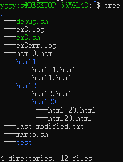
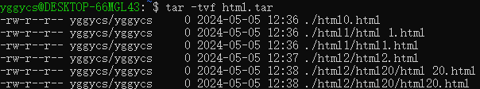

# 课程基本信息

课程网站：https://missing.csail.mit.edu/2020/

课程视频：https://www.youtube.com/playlist?list=PLyzOVJj3bHQuloKGG59rS43e29ro7I57J

# 课程笔记

## Lecture 1. Course overview + the shell

### command

*pwd* - print working directory

*cd* - change directory

*~(tilde)* - home directory

*-(dash)* - previous directory

*--help* - show the help info

*-l* - list the detail info 

*man* - manual page 

*<* - rewire the input stream

*\>* - rewire the output stream(overwrite)

*>>* - rewire the output stream(append)

*cat* - concatenate

*|* - pipe

*sudo su* - root

*sudo tee*

*xdg-open*

### Exercises

2. 
```shell
cd ../../tmp
mkdir missing
```

3. 
```shell
man touch
```

4. 
```shell
cd missing/
touch semester
```

5. 
```shell
echo '#!/bin/sh' > semester
echo 'curl --head --silent https://missing.csail.mit.edu' >> semester
```

6. 
``` shell
./semester
ls -l semester
```

7. 
``` shell
sh semester
```

8. 
``` shell
man chmod
```

9. 
``` shell
chmod 755 ./semester
./semester
```

10. 
``` shell
./semester | grep last-modified > ~/last-modified.txt
cat ~/last-modified.txt
```

11. 
``` shell
cat /sys/class/power_supply/battery/capacity
``` 

## Lecture 2. Shell Tools and Scripting
*$0* - the name of the script

*$1 - $9* - the args that the bash script takes

*$?* - th error code from the previous command

*$_* - the last arg of the previous command

*!!* - the last command

*$#* - the number of the args

*\$$* - the pid of the running command

*$@* - the all args 

*2>* - redirect the error standard stream

*$() <()* - replace cmd

### Exercises
1. 
```shell
man ls
ls -a -t -h --color=auto -l
```
2.  
```shell
#!/bin/bash

marco () {
        tmp_path=$(pwd)
}

polo () {
        cd "$tmp_path"
}
```

3.  
```shell
#!/bin/bash

ex3_path="/home/yggycs"

num=1
$ex3_path/ex3.sh > "$ex3_path/ex3.log"

while [ "$?" -ne 1 ]; do
        num=$(($num+1))
        $ex3_path/ex3.sh >> "$ex3_path/ex3.log" 2> "$ex3_path/ex3err.log"
done

echo "$num"
cat "$ex3_path/ex3.log" "$ex3_path/ex3err.log"
```

4.  

```shell
find . -name '*.html' | xargs -d '\n' tar -cvf html.tar
```


5.  
```shell
find . -type f | xargs -d '\n' ls -t -l -h
```

## Lecture 3. Editors (Vim)

## Lecture 4. Data Wrangling

## Lecture 5. Command-line Environment

## Lecture 6. Version Control (Git)

## Lecture 7. Debugging and Profiling

## Lecture 8. Metaprogramming

## Lecture 9. Security and Cryptography

## Lecture 10. Potpourri

## Lecture 11. Q&A